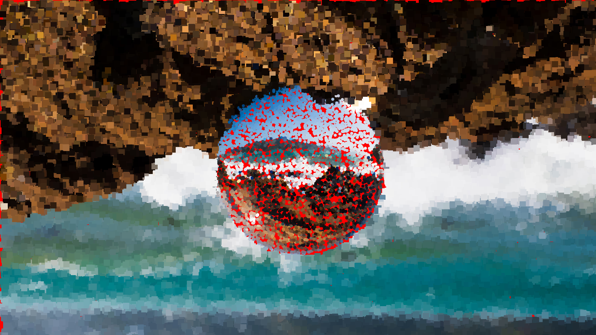
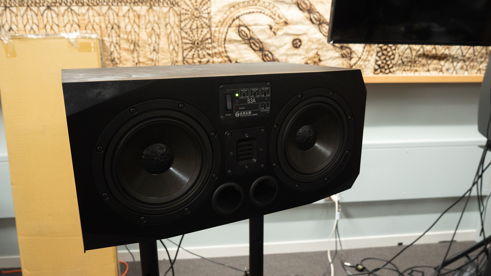
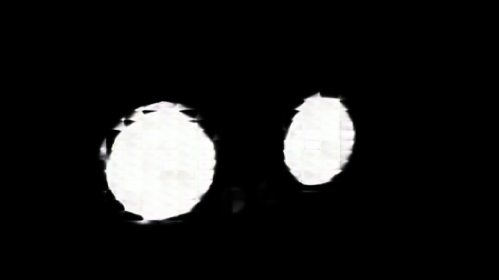
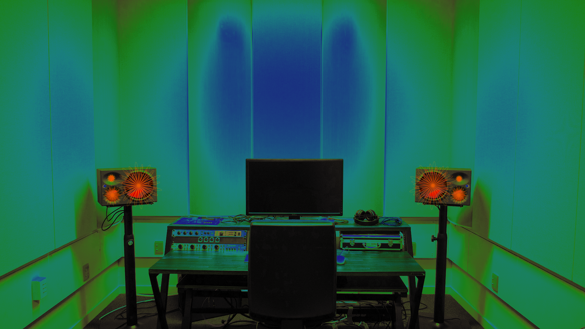
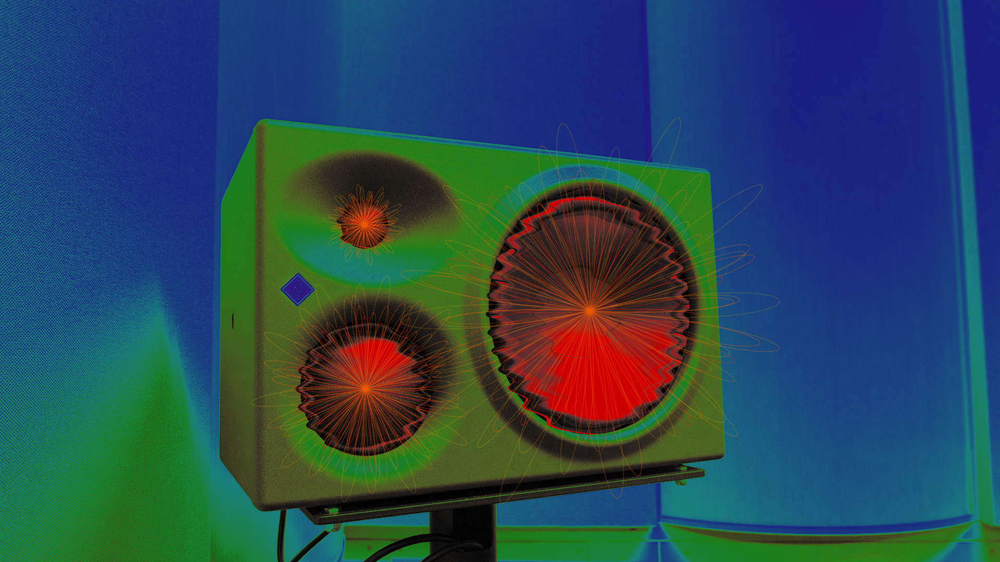
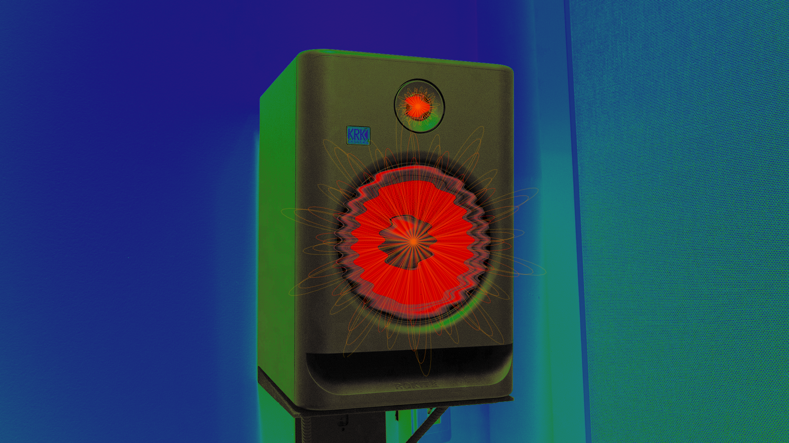
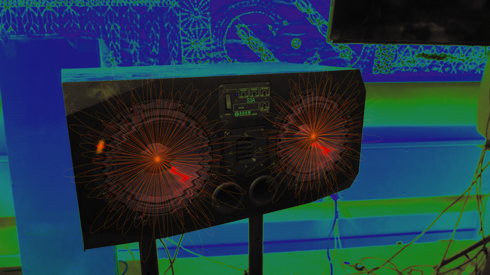
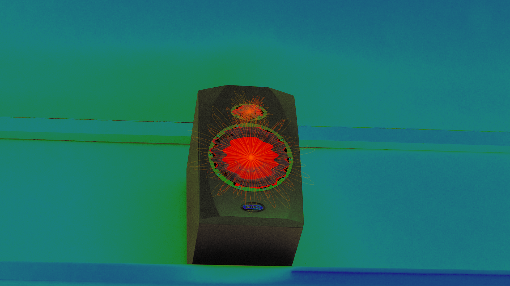
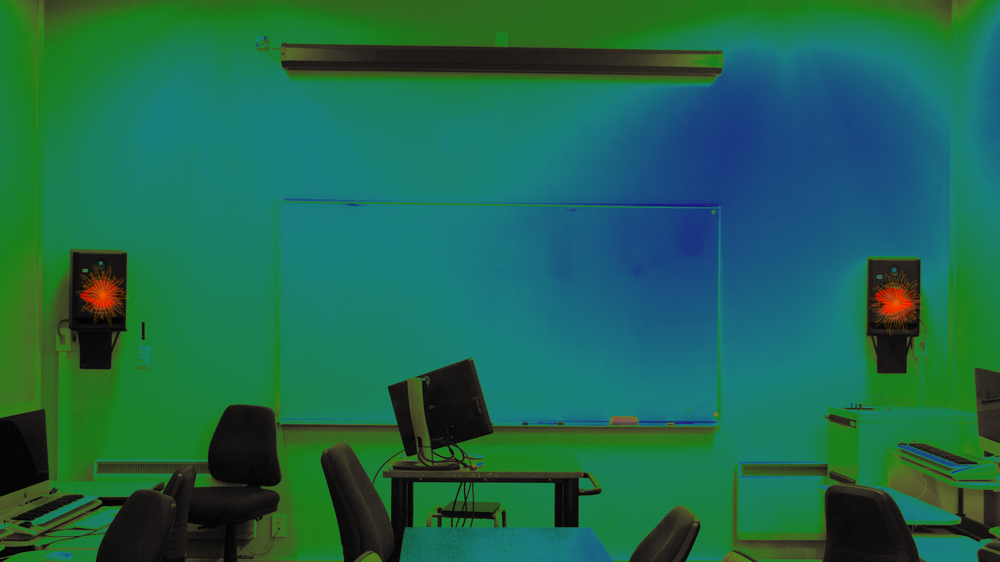

# MDDN 242 Project 3: Data Mapping

## Project Name: Audiography

#### By Ivan Mangubat

### Part 1: Initial Ideas

To get familiar with the code, I began processing some of the photos I took last year and experimenting with different effects such as pointillism and waves. This was when I noticed the amount of time needed to process some of these effects, especially the blur which proved to be the most intensive.

At this point, I was still brainstorming ideas on what I could achieve with the photos I currently have/will take and the processing I could apply to them to convey a message or theme.

### Part 2: Theme

I struggled to get the AI to incorporate my masks for my initial idea, as the content within those photos was too abstract. As a result, I changed my theme to studio equipment focusing on speaker monitors. As a Sonic Arts student, it is important to know the functionalities of a speaker and how its surrounding environment impacts its auditory quality, so it would be helpful to be able to visualise this concept through image processing.

### Part 2b: Training

After taking some photos of the recording studios at Kelburn, I created three masks of my own using Adobe Photoshop. Then, I compiled my images into a folder to be processed by the AI. I was worried that the AI would be unable to detect the speakers' diaphragms, but luckily it was brilliant at detecting the areas I wanted it to highlight.

### Part 3: Drawing Techniques

Next, I created the pixel treatment that would be applied to my images to convey my theme. I experimented with the pixels outside the masks until I achieved a lowered saturation and brightness adjustment layer. Surprisingly, this alone was sufficient enough to explain the audio treatment around the speaker, where the cooler blue colours represent areas with the least amount of frequency build-up, and the warmer green-red colours represent areas where audio waves are most prevalent.

To further elaborate on this theme, I made the pixels within the mask red as this is where all the audio is produced. I also applied a wave filter in these areas to create a cool vibrating effect.

Lastly, I wanted to add an extra effect to symbolise the audio waves that would come out of the speaker's diaphragms. This proved to be more of a challenge as this required scanning the mask and identifying the bounds of all white pixels so that the effect could be centred. I was able to achieve this with multiple functions that add all white pixels of the mask to an array and generate the minimum and maximum X and Y values of the given area. With these values, I created a spiraling effect that originate from the centre of the speakers.

### Part 4: Final Images

These are my six final images, the first half using the masks I created and the second half using the AI-generated masks.

### Citing External Influence

For this project, I used ChatGPT to assist with developing the functions for finding the bounds of the masks and locating its centre. I needed a way to check if a pixel has undergone the scanning process before, as not checking for this would heavily impact the loading time. ChatGPT was able to suggest marking a pixel's RGBA value to a certain number and checking for that when scanning the pixels, which was able to work as intended. I integrated its suggestion into my code, opting to set the red value to 255 as my number to check.

### Reflection

I found this project to be challenging, mostly because progress is bottlenecked by the AI as the script to run it has to be done manually. I also was not satisfied with the photos I produced, partly because of the limited number of speakers on campus that I was aware of as well as insufficient time to develop my idea further. Despite these limitations, I am proud to produce a semantic filter that works within my theme and the brief, and theoretically this concept can be refined and improved in the future to assist with critical decision-making when setting up a studio environment.